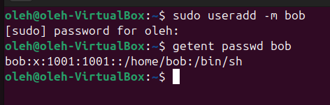
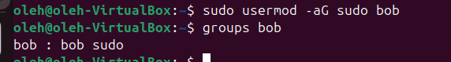
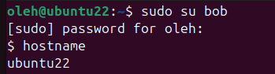
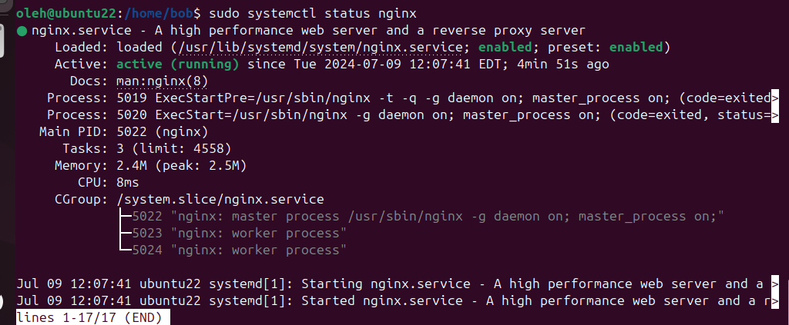
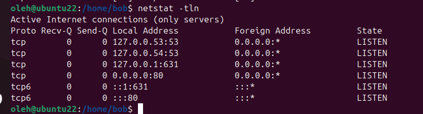

## Create a user named "bob".
`sudo useradd -m bob`


## Add the created user to the sudo group (so that they can run commands as an administrator).
`sudo usermod -aG sudo bob`



## Create a script in the /home/bob/ directory that, when executed, will change the hostname to "ubuntu22". The script's execution attributes should be set exclusively for the user "bob".
_change_host.sh_
```bash
#!/bin/bash
sudo hostnamectl set-hostname ubuntu22
```
`sudo chown bob:bob /home/bob/change_hostname.sh`
`sudo chmod 700 /home/bob/change_hostname.sh`

## Run the script. Reboot the system. Log into the system as the "bob" user.
`sudo -u bob bash /home/bob/change_hostname.sh`


## Install "nginx". Check if nginx is running, also use netstat to see which ports are open.
`sudo apt update`
`sudo apt install -y nginx`
`sudo systemctl start nginx`
`sudo systemctl status nginx`

`sudo apt install -y net-tools`
`netstat -tln`

